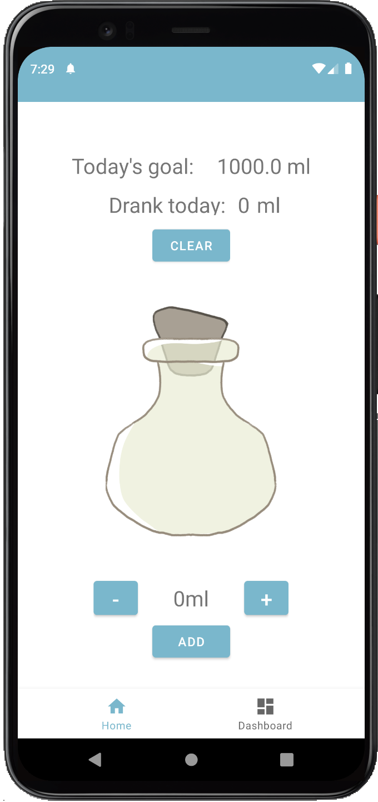
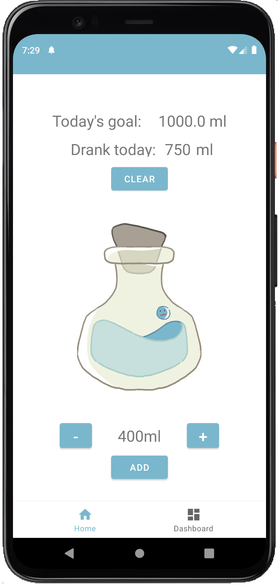
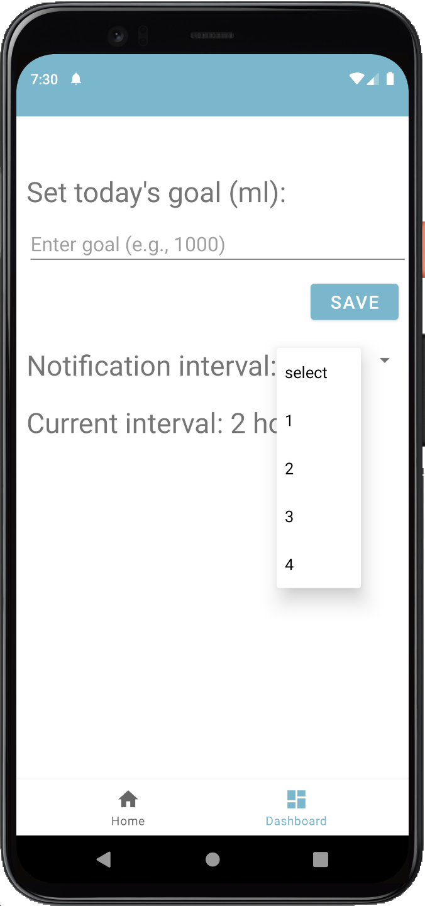
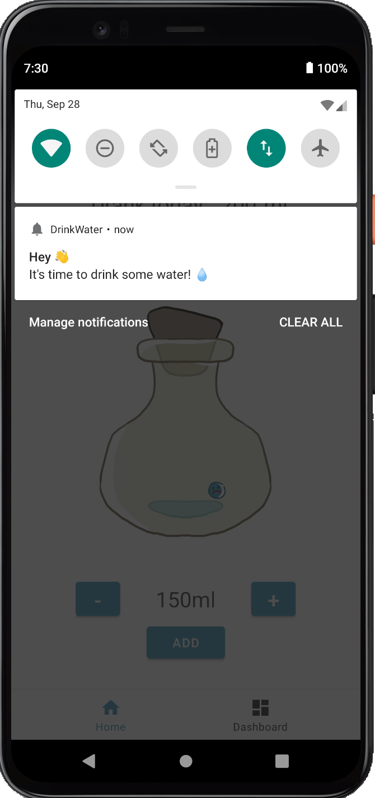
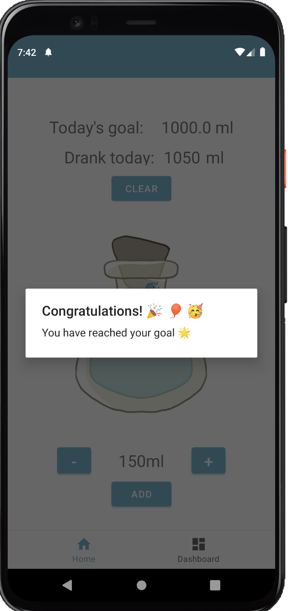

# DrinkWater Reminder App

The DrinkWater Reminder App is a simple and effective Android application developed in Kotlin to help you stay hydrated throughout the day. Dehydration can have negative effects on your health and productivity, but with this app, you can easily track your daily water intake and receive timely reminders to drink water.

## Features

### 1. Home Page

- **Bottle of water**: The home page has a bottle that starts off empty.

- **Add Water**: You can click the "Add" button to log the amount of water you have consumed. 

- **Total Amount**: The total amount of water you have consumed for the day is displayed on the home page.

- **Daily Goal**: Your daily water intake goal is also displayed on the home page to help you stay on track.

- **Visual Progress**: As you log your water intake, the bottle image visually fills up to represent your progress towards your daily goal.

- **Congratulatory Alert**: When you reach or exceed your daily water intake goal, a congratulatory alert dialog appears to celebrate your achievement.

### 2. Settings Page

- **Set Daily Goal**: In the settings page, you can set your desired daily water intake goal in milliliters (ml). 

- **Notification Interval**: You can select the desired notification interval (in hours) from a spinner. For example, if you choose 2 hours, the app will send a pop-up notification every 2 hours to remind you to drink water.

## Screenshots

       

---

Thank you for using the DrinkWater Reminder App! Stay hydrated and healthy.
